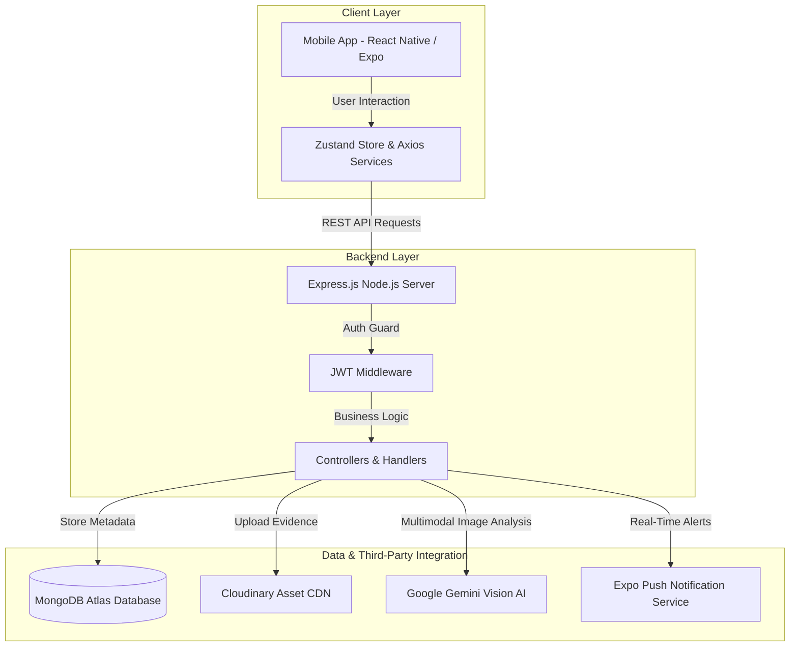

<div align="center">

# 🏛️ CivicSafe
### *AI-Powered Civic Issue Reporting & Anti-Cheat Resolution Platform*

[](https://reactnative.dev/)
[](https://expo.dev/)
[](https://nodejs.org/)
[](https://expressjs.com/)
[](https://www.mongodb.com/)
[](https://deepmind.google/technologies/gemini/)
[](https://cloudinary.com/)
[](LICENSE)

<p align="center">
  <b>CivicSafe</b> is a full-stack, enterprise-grade mobile & web governance ecosystem that bridges the gap between citizens and municipal authorities. Powered by <b>Google Gemini Multimodal AI</b>, CivicSafe automates incident detection, prevents fake resolution submissions, and tracks municipal maintenance in real-time.
</p>

[Key Features](#-key-features) • [System Architecture](#-system-architecture) • [Tech Stack](#%EF%B8%8F-tech-stack) • [Installation Guide](#-installation-guide) • [API Documentation](#-api-documentation) • [Environment Reference](#%EF%B8%8F-environment-variables)

---

</div>

## 📌 Executive Summary

Urban municipal management frequently suffers from **delayed issue resolution, lack of verification, fake completion claims, and poor tracking transparency**. 

**CivicSafe** addresses these bottlenecks through an end-to-end automated platform:
1. **Citizens** capture live photos of civic problems (potholes, garbage accumulation, broken streetlights, water logging) tagged with exact GPS coordinates.
2. **Google Gemini Vision AI** instantly inspects submissions to verify legitimacy, detect spam/selfies, classify categories, and estimate severity.
3. **Municipal Officers** receive prioritized tasks on an admin dashboard with geolocation mapping.
4. **Resolution Verification Engine** forces department staff to upload live repair photos, which Gemini AI compares against original citizen photos to verify landmark consistency before closing the ticket.
5. **Real-time Notifications** keep citizens updated through every lifecycle phase via Expo Push Notifications.

---

## 🔥 Key Features

### 📸 1. AI-Powered Fraud Prevention & Verification
* **Automated Fake Submission Filtering:** Gemini Vision AI evaluates uploaded citizen photos to verify if an actual civic issue is present, rejecting selfies, internet downloads, or unrelated images.
* **Dual-Proof Anti-Cheat Engine:** Prevents corruption and false task closures by comparing the *Before Repair* (citizen upload) and *After Repair* (admin upload) photos. The ticket is marked "Resolved" only if AI validates landmark matching.

### 📍 2. High-Accuracy Geolocation & Dynamic Mapping
* **Real-Time GPS Tagging:** Captures precise device latitude and longitude coordinates alongside reverse-geocoded street addresses.
* **Interactive Map Clusters:** Admin map views highlight high-priority problem zones for optimized worker routing.

### 🔦 3. Custom Hardware Camera Integration
* Native Expo Camera interface equipped with **hardware flash control**, resolution optimization, orientation correction, and strict gallery upload guards to prevent spoofed photos.

### 🔔 4. Real-Time Push Notifications
* Multi-channel push notification alerts powered by **Expo Push API** notifying users instantly when their report status updates (`Submitted` ➔ `In Progress` ➔ `Resolved`).

### 🔑 5. Role-Based Access Control (RBAC) & Secure Auth
* Separate views and security policies for **Citizens** and **Municipal Admins**.
* Authentication backed by **JWT session tokens** and **Firebase Client Auth** password recovery & reset handshakes.

---

## 🏗 System Architecture



---

## 🛠️ Tech Stack

### **Mobile Frontend (App)**
| Component | Technology Used |
| :--- | :--- |
| **Framework** | React Native (Expo SDK 51) |
| **Language** | TypeScript |
| **State Management** | Zustand (Global Store) |
| **Navigation** | React Navigation (Native Stack + Bottom Tabs) |
| **Networking** | Axios with Interceptors |
| **Hardware APIs** | `expo-camera`, `expo-location`, `expo-notifications`, `expo-image-picker` |
| **Icons & Design** | `lucide-react-native`, Custom Design System |

### **Backend Server**
| Component | Technology Used |
| :--- | :--- |
| **Runtime & Framework** | Node.js, Express.js |
| **Language** | TypeScript |
| **Database** | MongoDB Atlas with Mongoose ODM |
| **Authentication** | JSON Web Tokens (JWT), Firebase Admin SDK |
| **Media Hosting** | Cloudinary CDN |
| **AI Integration** | `@google/genai` (Gemini 1.5 / 2.0 Flash) |
| **Logging & Security** | Winston Logger, Zod Validator, Cors, Helmets |

---

## 📁 Repository Structure

```
civic-app/
├── app/                        # React Native / Expo Mobile Application
│   ├── assets/                 # Static images, fonts, and splash assets
│   ├── src/
│   │   ├── components/         # Reusable UI components (Buttons, Cards, Inputs)
│   │   ├── constants/          # App theme, color tokens, layout specifications
│   │   ├── context/            # Zustand global state stores (Auth, User Profile)
│   │   ├── hooks/              # Custom React Hooks (Permissions, Logic abstractions)
│   │   ├── navigation/         # App Navigators (Auth Stack, Citizen Tabs, Admin Stack)
│   │   ├── screens/            # Screen views (Citizen Dashboard, Camera, Admin Portal)
│   │   ├── services/           # Axios API connection endpoints
│   │   ├── types/              # TypeScript interface definitions
│   │   └── utils/              # Helper functions & formatters
│   ├── app.json                # Expo build configuration manifest
│   └── package.json            # Mobile dependencies
│
├── backend/                    # Node.js / Express TypeScript Server
│   ├── src/
│   │   ├── config/             # Environment setup, MongoDB & Cloudinary configs
│   │   ├── controllers/        # Route logic handlers (Auth, Report, Admin, AI)
│   │   ├── middleware/         # Auth verification guards & Error loggers
│   │   ├── models/             # Mongoose Schemas (User, Report, Department)
│   │   ├── routes/             # Express endpoint mapping
│   │   ├── services/           # External API integrations (Gemini AI, Cloudinary, Push)
│   │   ├── types/              # Server-side TypeScript interfaces
│   │   └── utils/              # Winston logger & Zod schemas
│   ├── index.ts                # Server entry point
│   └── package.json            # Backend dependencies
│
└── README.md                   # Project documentation
```

---

## 🚀 Installation Guide

### Prerequisites
- [Node.js](https://nodejs.org/) `v18.x` or higher
- [npm](https://www.npmjs.com/) or [yarn](https://yarnpkg.com/)
- [Expo Go](https://expo.dev/client) app installed on a physical mobile device (or Android Studio / Xcode simulator)
- Active accounts for **MongoDB Atlas**, **Cloudinary**, and **Google AI Studio (Gemini API)**

---

### 1. Clone the Repository
```bash
git clone https://github.com/VaibhavPandey-01/civic-app.git
cd civic-app
```

---

### 2. Backend Setup
```bash
# Navigate to backend directory
cd backend

# Install dependencies
npm install

# Create environment configuration file
cp .env.example .env
```

Configure your `backend/.env` file:
```env
PORT=5000
MONGODB_URI=mongodb+srv://<username>:<password>@cluster.mongodb.net/civic_db
JWT_SECRET=your_super_secret_jwt_key

CLOUDINARY_CLOUD_NAME=your_cloudinary_cloud_name
CLOUDINARY_API_KEY=your_cloudinary_api_key
CLOUDINARY_API_SECRET=your_cloudinary_api_secret

GEMINI_API_KEY=your_google_gemini_api_key

FIREBASE_PROJECT_ID=your_firebase_project_id
```

Run the backend development server:
```bash
npm run dev
```
*Server will start running at `http://localhost:5000` (or `https://civic-app-3wdi.onrender.com` in production).*

---

### 3. Mobile App Setup
```bash
# Navigate to app directory
cd ../app

# Install dependencies
npm install
```

Configure `app/src/services/api.ts` or `.env`:
```typescript
export const API_BASE_URL = 'https://civic-app-3wdi.onrender.com/api'; // Or your local network IP
```

Start the Expo Development Server:
```bash
npx expo start
```
*Scan the generated QR code using the **Expo Go** app on your Android or iOS device.*

---

## ⚙️ Environment Variables

| Variable | Description | Location | Required |
| :--- | :--- | :--- | :---: |
| `PORT` | Backend server port | Backend `.env` | Yes |
| `MONGODB_URI` | MongoDB Atlas connection string | Backend `.env` | Yes |
| `JWT_SECRET` | Secret key for signing authorization tokens | Backend `.env` | Yes |
| `GEMINI_API_KEY` | Google Gemini Multimodal API Key | Backend `.env` | Yes |
| `CLOUDINARY_CLOUD_NAME` | Cloudinary account name for media storage | Backend `.env` | Yes |
| `CLOUDINARY_API_KEY` | Cloudinary API Key | Backend `.env` | Yes |
| `CLOUDINARY_API_SECRET` | Cloudinary API Secret | Backend `.env` | Yes |
| `API_BASE_URL` | Base API URL pointing to Node.js server | App Config | Yes |

---

## 📡 API Endpoint Summary

### 🔑 Authentication Routes (`/api/auth`)
| Method | Endpoint | Description | Access |
| :--- | :--- | :--- | :--- |
| `POST` | `/register` | Register a new Citizen or Admin user | Public |
| `POST` | `/login` | Authenticate user & return JWT token | Public |
| `POST` | `/reset-password` | Initiate password reset request | Public |

### 📝 Issue Reporting Routes (`/api/reports`)
| Method | Endpoint | Description | Access |
| :--- | :--- | :--- | :--- |
| `POST` | `/create` | Submit a new civic report with AI validation | Citizen |
| `GET` | `/my-reports` | Fetch logged-in user's submitted reports | Citizen |
| `GET` | `/:id` | Get detailed report timeline & status | Citizen / Admin |

### 🛡️ Admin & Resolution Routes (`/api/admin`)
| Method | Endpoint | Description | Access |
| :--- | :--- | :--- | :--- |
| `GET` | `/reports` | List all reported issues filtered by status/dept | Admin |
| `PATCH` | `/reports/:id/assign` | Assign field worker to an open issue | Admin |
| `POST` | `/resolution/upload` | Upload completion photo & run Gemini verification | Admin |

---

## 🤝 Contributing

Contributions are welcome! If you find a bug or have a feature suggestion, feel free to open an Issue or submit a Pull Request.

1. Fork the Project
2. Create your Feature Branch (`git checkout -b feature/AmazingFeature`)
3. Commit your Changes (`git commit -m 'Add some AmazingFeature'`)
4. Push to the Branch (`git push origin feature/AmazingFeature`)
5. Open a Pull Request

---

## 📄 License

Distributed under the **MIT License**. See `LICENSE` for more information.

<div align="center">

---
Developed by **[Vaibhav Pandey](https://github.com/VaibhavPandey-01)**

*Empowering Communities Through Smart AI Governance*

</div>
